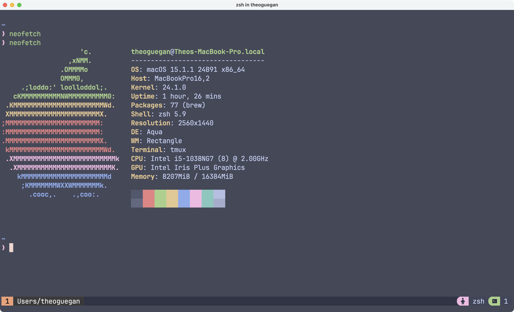

# Dotfiles

This repository contain an installation script to download sotfware and dotfiles for my personal development environment.



## Essential Tools

- **Editor**: [VSCode](https://code.visualstudio.com/) with some extensions
- **Multiplexer**: [Tmux](https://github.com/tmux/tmux/wiki)
- **Main Terminal**: [Allacrity](https://alacritty.org/index.html) a fast, cross-platform, OpenGL terminal emulator written in Rust
- **Shell Prompt**: [Oh My Posh](https://ohmyposh.dev/), a prompt theme engine for any shell written in Go

## Setup

### MacOS

1. Install Apple's Command Line Tools, which are prerequisites for Git and Homebrew.

```zsh
xcode-select --install

```

2. Clone repo into your Home directory.

```zsh
# Use SSH (if set up)...
git clone git@github.com:theguega/be-a-dev.git ~/

# ...or use HTTPS and switch remotes later.
git clone https://github.com/theguega/be-a-dev.git ~/
```

3. Run installation script.

```zsh
cd ~/be-a-dev
./install.sh
```

4. Restart your computer.

5. Enjoy!


## Adding New Dotfiles and Software

### Dotfiles

Dotfiles are managed using GNU Stow, which is a symbolic link manager that allows you to create symlinks to files and directories. To add a new dotfile, simply create a new file in the `dotfiles` directory and run the `stow` command to create the symlink.

### Sotfware

Software is managed using Homebrew, which is a package manager for macOS.
To add a new package to the list, you can edit the `homebrew/Brewfile`.

## Future Plans

- Change the terminal emulator to [Ghostty](https://github.com/ghostty-org)
- Setup sofware and dotfiles for Linux
- See if using Nix package manager is a good idea for cross-platform setup
- Use ansible to have an idempotent setup [Ansible](https://www.ansible.com/)

## Inspiration

https://github.com/hendrikmi/dotfiles/tree/main
