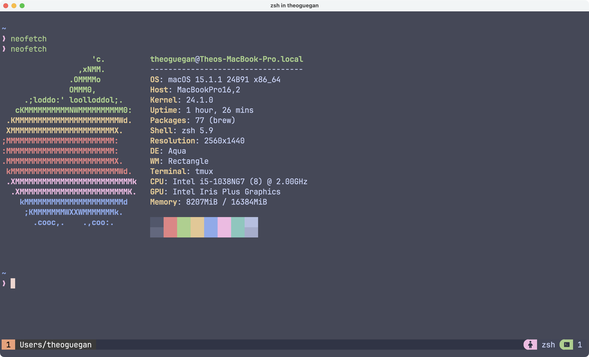

# Dotfiles

Personal development environment: a cross-platform [install script](#installation) (macOS Intel, Apple Silicon, and Linux), [Homebrew](https://brew.sh/) for CLI tools, and [GNU Stow](https://www.gnu.org/software/stow/) for configuration symlinks.



## Essential tools

- **Editor**: [Zed](https://zed.dev/)
- **Terminal**: [Ghostty](https://ghostty.org/)
- **Prompt**: [Oh My Posh](https://ohmyposh.dev/)
- **Shell**: [Zsh](https://www.zsh.org/)
- **Editor (modal)**: [Neovim](https://neovim.io/)

## Setup

### Prerequisites

**macOS:** [Xcode Command Line Tools](https://developer.apple.com/library/archive/technotes/tn2339/_index.html) (needed for Git and Homebrew):

```zsh
xcode-select --install
```

**Linux (Debian/Ubuntu):** No extra prep; the installer uses `apt` where needed.

### Clone

```zsh
git clone git@github.com:theguega/.dotfiles.git ~/.dotfiles
# or HTTPS: git clone https://github.com/theguega/.dotfiles.git ~/.dotfiles
cd ~/.dotfiles
```

### Installation

**Interactive** (prompts for each step; SSH sessions skip GUI/GNOME prompts automatically):

```zsh
./install.sh
```

**Non-interactive** (flags only; same SSH/GUI guards apply):

```zsh
./install.sh --help          # options and examples
./install.sh -a              # everything applicable on this OS
./install.sh --cli --ui --defaults
```

| Flag | Effect |
|------|--------|
| `-a` / `--all` | All options that apply on this platform |
| `-c` / `--cli` | [Homebrew](https://brew.sh/) formulae from `homebrew/Brewfile` |
| `-u` / `--ui` | macOS: casks · Linux: desktop `apt` packages + fonts |
| `-d` / `--defaults` | macOS `defaults` (Finder, Dock, keyboard, …) |
| `-g` / `--gnome` | Linux: GNOME extensions and hotkeys |

The installer does **not** run Stow; it sets up software, optional OS/desktop tweaks, and creates `~/.zsh/local.zshenv` when needed (see [Zsh](#zsh)). Restart after large system or GNOME changes if something still looks stale.

### Linking configs with Stow

[Stow](https://www.gnu.org/software/stow/) is installed via Homebrew (`brew "stow"` in the Brewfile). After `./install.sh`, symlink the packages you want from the repo into your home directory, for example:

```zsh
cd ~/.dotfiles
stow zsh git nvim zed ghostty
```

Use `stow -n …` first to preview. Host-specific shell snippets go in `~/.zsh/local.zshenv` and `~/.zsh/local.zshrc` (see below); they are not tracked in git.

## Zsh

| File | Role |
|------|------|
| `zsh/.zshenv` → `~/.zshenv` | Loaded for every zsh process: minimal `LANG` / `EDITOR`, then `~/.zsh/local.zshenv` if present |
| `zsh/.zshrc` → `~/.zshrc` | Interactive only: history, completion, Homebrew-backed plugins, prompt, aliases |
| `~/.zsh/local.zshenv` | Per-machine: `brew shellenv`, extra `PATH`, toolchain flags (installer can create this and add Homebrew) |
| `~/.zsh/local.zshrc` | Per-machine interactive overrides |

Optional: `~/.keys/export_keys.sh` is sourced from `.zshrc` when the file exists.

## What gets installed

Details live in `homebrew/Brewfile` and in `install/linux.sh` (desktop `apt` packages on Linux). At a glance:

- **Cross-platform (Homebrew formulae):** `fzf`, `fd`, `ripgrep`, `eza`, `zoxide`, `neovim`, `stow`, `lazygit`, `bat`, `gcc`, `llvm`, `cmake`, and others listed in the Brewfile.
- **macOS (casks):** Ghostty, Zed, Cursor, VS Code, Raycast, Aerospace, fonts, etc. (see Brewfile `if OS.mac?` block).
- **Linux:** Same CLI formulae via Linuxbrew; desktop packages such as VLC and `gnome-shell-extension-manager` via `apt` when you choose the UI step; JetBrains Mono Nerd Font downloaded to `~/.local/share/fonts`.

## Customization

### New or updated dotfiles

1. Add files under the right package directory (e.g. `zsh/`, `git/`).
2. Run `stow <package>` from the repository root so symlinks point at the new files.

### New CLI packages

Edit `homebrew/Brewfile`:

```ruby
brew "package-name"
```

### macOS GUI apps

Add casks inside the `if OS.mac?` … `end` block in `homebrew/Brewfile`.

### Linux desktop packages

Edit the `apt install` list in `install/linux.sh` (function `linux_install_ui_packages`).

## Testing the installer

**Docker (Linux, CLI-only):** [Docker](https://docs.docker.com/get-docker/) can run automated checks of `./install.sh -c` (Homebrew formulae, no GUI) in parallel. Containers are **Linux only** — there is no supported way to run macOS inside Docker, so exercise the macOS installer on a **real Mac** when you need to validate Intel vs Apple Silicon.

```zsh
cd ~/.dotfiles
./test/parallel-server-install.sh
```

This starts **three** `linux/amd64` jobs at once (Ubuntu 24.04, Ubuntu 22.04, Debian bookworm slim): each copies the repo into the container, creates a non-root user, and runs `./install.sh -c`. Logs are written under a temporary directory; the script prints the path when it exits.

**Notes:**

- Typical **amd64** Linux hosts cannot run `linux/arm64` images without [QEMU / binfmt](https://github.com/multiarch/qemu-user-static); the script uses three **amd64** images instead of mixing architectures.
- Minimal images may not include `/bin/zsh`, so the installer may skip `chsh` — that is expected in this test.
- For **macOS**, run `./install.sh -c` (or other flags) directly on the machine; compare Intel and Apple Silicon by running it on each hardware once.

## Project structure

```
.dotfiles/
├── install.sh              # Entrypoint: sources install/run.sh
├── install/
│   ├── run.sh              # Prompts or CLI flags, dispatches macOS/Linux
│   ├── macos.sh            # Xcode CLT, Homebrew, Brewfile splits, defaults
│   ├── linux.sh            # apt, Linuxbrew, Brewfile, apt UI, GNOME
│   └── lib/                # utils, env detection, Brewfile helpers, ~/.zsh/local.zshenv
├── homebrew/
│   └── Brewfile            # Formulae + macOS casks
├── zsh/                    # .zshenv, .zshrc (stow as `zsh`)
├── git/                    # git config (stow as `git`)
├── nvim/                   # Neovim (stow as `nvim`)
├── zed/                    # Zed (stow as `zed`)
├── ghostty/                # Ghostty (stow as `ghostty`)
├── ohmyposh/               # Oh My Posh theme (stow as `ohmyposh`)
├── test/                   # Docker parallel test for Linux CLI install (optional)
└── …                       # Other tool-specific trees
```

## Troubleshooting

- **Permission denied:** `chmod +x install.sh`
- **Homebrew on macOS:** Ensure Command Line Tools are installed; on Apple Silicon vs Intel, `brew` lives under `/opt/homebrew` or `/usr/local` (handled via `~/.zsh/local.zshenv`).
- **Empty PATH in a new shell:** Ensure `~/.zsh/local.zshenv` contains the right `eval "$(…/brew shellenv)"` for that machine, or re-run the installer’s relevant steps.

## Inspiration

[hendrikmi/dotfiles](https://github.com/hendrikmi/dotfiles/tree/main)
